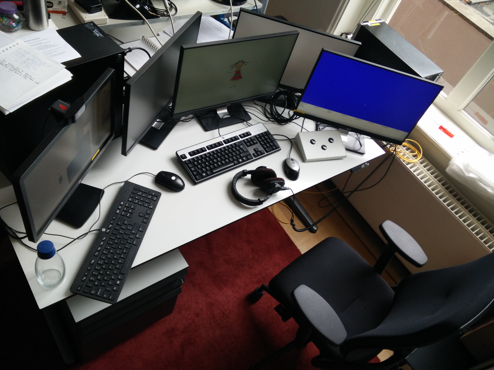

# Head-turn Preference Procedure
You can find the source-code for this experiment at [GitHub](https://github.com/UiL-OTS-labs/ZEP2-headturn-preference-BOILERPLATE).
*   Originally authored by: [Theo Veenker](theo.veenker@beexy.nl)
*   Adapted by: [Chris van Run](C.P.A.vanrun@uu.nl)
*   For client: [Maartje de Klerk](https://www.uu.nl/medewerkers/MdeKlerk/0)

## Description:
Purpose of this ZEP-based experiment is to see whether an infant participant
can detect a difference between two types of auditory stimuli. The
infant sits on the caregiver lap facing a wall on which a green
light, an invisible speaker and a camera is mounted. On each side
wall a red light (or other visual stimuli) and an invisible speaker are mounted.
In this implementation there is a familiarization phase and a test phase.

For each trial in the test phase the infant's attention is drawn to
one the side lights (blinking). When the infant looks at the blinking
light a sequence of sound stimuli starts and a timer runs as long
as the infant keeps looking at the blinking light. The trial ends
when the infant looks away too long (or when a particular number of
stimuli have been presented). In the familiarization phase that
precedes the test phase a similar contingency procedure is used but
only for the lights; the sound stimuli once started continue until
all have been presented.

In this implementation the front and side lights will be presented
via three computer monitors. Therefore this implementation requires
a quad head videocard.

The familiarization-items presentation order is random. The test-items order is pseudorandomized such that there are never more than three of novel-type items (NOVEL) or familiar-type items (FAMIL) that appear in sequence.

Output familiarization phase: total looking time.
Output test phase: looking time.

## Preview Experiment
Included in this repository is a preview video of a single run of the experiment.

## About Zep
For information on running the experiment and extracting the experiment
results please go the Zep website at <http://www.beexy.nl/zep> and check
out the documentation section. There you'll also find explanations and
instructions that help you understand and modify a Zep experiment.

## Modifying or Customizing this Experiment
_Add stimuli_. Add the WAV sound files to `stimuli/sounds` directory and edit the stimuli lists at `stimuli/[...].csv`

_Edit stimuli lists_. Every line represents one experiment trial. Each variable separates by a semicolon (`;`).
*   `id` is a unique reference for human convenience. `
*   `type` is either NOVEL or FAMIL.
*   `sndfn` is the soundfile that plays (e.g. 'test.wav').
*   `sound_direction` dictates which direction the sound should come from and should be one of the following values:
    *   `FRONT_SIDE`/`LEFT_SIDE`/`RIGHT_SIDE`: self explanatory
    *   `LEFT_AND_RIGHT_SIDE`: plays both in the left and right channel simultaneously.
    *   `PSEUDO_RANDOM_SIDE`: pseudo-random side with the restriction that one side not allowed more than twice in a row. Note that this does not count manually set sides.

_Fine tune your hardware setup_. As mentioned above a quad-head setup is required (four monitors). Window- and head -linking settings is read from `modules/baby_windows3_settings.zm`. You can find out the order of heads and location by running `zepdpyinfo` in a terminal. Sound settings are in `modules/sound_settings.zm`. You can find out the specifics of the sound card(s) installed by running `zepsndinfo` in a terminal. This script assumes that the order of channels are front left, front right, rear/side left, rear/side right.

## About the Hardware Setup
Optimally, the setup should use a _single_ graphical card that supports at least five monitor outputs. Using more than one graphical card leads to asynchronous visual blanks and minor visual artifacts. A _stimulus-presentation computer_ should have this card installed along with an good-quality sound card. The stimulus-presentation computer should output to five monitors. One to the researcher, three to the participant (i.e. left, middle, right) and one to a video-capture card in a _recording computer_. The researcher-display signal and the video-capture signal should be duplicates. The recording computer can then apply a chroma-key to the display signal, overlay it on a video feed and save the result for [off-line analysis](https://github.com/UiL-OTS-labs-backoffice/UiL-OTS-Video-Coding-System). To get the multi-head setup to function under Kubuntu (Linux/GNU OS) we had to use the Nvidia's [baseMosaic](http://nvidia.custhelp.com/app/answers/detail/a_id/3580/~/how-to-configure-mosaic-on-linux) feature.

The critical hardware/software used in the UiL-OTS lab is as follows:
*   3 x Nvidia NVS 310 GPUs (though we recommend using a single NVS 810 instead)
*   Asus Xonar Dx (sound card)
*   BlackMagic Decklink (video-capture card)
*   Logitech Webcam C920
*   Open Broadcaster Studio (software)
*   Zep 2.0.9

## References
*   Kemler-Nelson, D. G., Jusczyk, P. W., Mandel, D. R., Myers, J., Turk, A. & Gerken, L. (1995). The Head-turn Preference Procedure for testing auditory perception. Infant Behavior and Development 18, 111-116. [doi](https://doi.org/10.1016/0163-638395900128)
*   KERKHOFF, A., DE BREE, E., DE KLERK, M., & WIJNEN, F. (2013). Non-adjacent
dependency learning in infants at familial risk of dyslexia. Journal of Child Language, 40(1), 11-28. [doi](https://doi.org/10.1017/S0305000912000098)

## Disclaimer
This experiment script is released under the terms of the GNU General Public
License (see <http://www.gnu.org/licenses/gpl-2.0.html>). It is distributed in
the hope that it will be useful, but with absolutely no warranty. It is your
responsibility to carefully study and test the script before using it with
real participants.
